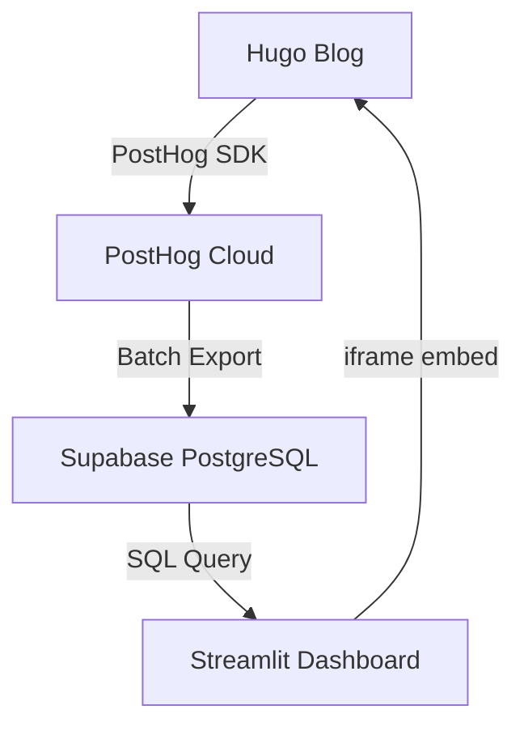

# PostHog + Supabase + Streamlit Migration Plan

## Context for Future Claude Sessions

### Project Overview
**What:** A/B Testing Simulator embedded in a Hugo blog (Science of Marketing Analytics) demonstrating enterprise-grade experimentation and analytics workflows.

**Current Stack:**
- **Frontend:** Hugo static site (Rusty Typewriter theme) hosted on Fly.io
- **Simulator:** Custom word-search puzzle game with variant A (3 words) and variant B (4 words)
- **Current Tracking:** Custom JavaScript tracking events to Supabase via localStorage for variant assignment
- **Current API:** FastAPI (Python) on Fly.io serving stats endpoints
- **Current Dashboard:** Custom HTML/CSS/JS with Plotly.js for visualizations
- **Database:** Supabase (PostgreSQL) with events table

**Current Architecture:**
```
Hugo (puzzle game) → Custom JS tracking → localStorage (variant) → FastAPI → Supabase → Custom HTML/CSS dashboard
```

**What's Working Well:**
- ✅ Puzzle game mechanics (word search, timer, validation)
- ✅ Event tracking to Supabase (started, completed, attempted events)
- ✅ Leaderboard with localStorage persistence
- ✅ Basic stats calculation in Python
- ✅ Three-column layouts (puzzle + leaderboard, stats dashboard)
- ✅ Hugo shortcodes for clean separation (ab-simulator-puzzle.html, ab-simulator-dashboard.html, ab-simulator-code.html)

**Pain Points:**
- ❌ Too much custom HTML/CSS for stats rendering
- ❌ localStorage variant assignment is toy code (not enterprise-grade)
- ❌ Manual stats calculations and rendering
- ❌ Hard to iterate on analysis/visualizations
- ❌ FastAPI feels like unnecessary middleware

### User's Working Principles
1. **Chunk-based approach:** Break work into small, verifiable pieces. Complete one chunk, verify it works, then move to next.
2. **Minimalism:** Always seek the simplest solution. Reduce code, reduce dependencies, reduce complexity.
3. **Enterprise mindset:** Not building a toy blog. Demonstrating cutting-edge data science and analytics foundations suitable for real companies.
4. **Learning value:** Prefer tools that have work/career value (e.g., Streamlit over custom dashboards).
5. **Tools over custom code:** Prefer established tools over rolling custom solutions.
6. **Single source of truth:** Data transformations and analysis should happen in one place (Python/Pandas), not scattered across API + JS + HTML.
7. **Verify before proceeding:** After each chunk, stop and verify it works before moving forward.

### Key Files and Structure
```
soma-blog-hugo/
├── content/
│   └── experiments/
│       └── ab-test-simulator.md          # Main page content
├── layouts/
│   └── shortcodes/
│       ├── ab-simulator-puzzle.html       # Puzzle game HTML
│       ├── ab-simulator-dashboard.html    # Stats dashboard HTML
│       └── ab-simulator-code.html         # Python code display
├── static/
│   ├── css/
│   │   └── ab-simulator.css              # All simulator styles
│   └── js/
│       └── ab-simulator.js               # All simulator logic
├── api/                                   # FastAPI (to be removed)
│   ├── main.py
│   ├── stats.py
│   └── visualizations.py
└── assets/
    └── css/
        └── custom.css                     # Site-wide custom CSS
```

**Supabase Schema:**
```sql
events table:
- id (uuid)
- experiment_id (varchar)
- user_id (varchar)
- variant (varchar) -- 'A' or 'B'
- action_type (varchar) -- 'started', 'completed', 'attempted'
- completion_time (integer) -- milliseconds
- success (boolean)
- attempts_count (integer)
- timestamp (timestamp)
- metadata (jsonb)
```

### Design Decisions Made
- **Three-column layouts:** Used CSS Grid (`display: grid; grid-template-columns: 1fr 1fr 1fr`) for clean responsive layouts
- **No dark mode:** Disabled via hugo.toml and CSS (`#theme-switcher { display: none }`)
- **75vw page width:** Simulator page uses wider layout (`max-width: 75vw`) with sidebar hidden (`aside#side-pane { display: none }`)
- **Hugo shortcodes:** Separated HTML into reusable shortcodes to keep markdown clean
- **Auto-refresh:** Dashboard auto-refreshes every 10 seconds (configurable via `POLLING_INTERVAL_MS` constant)

### Current Challenges to Address
1. Replace localStorage variant assignment with PostHog experiments (proper statistical rigor)
2. Eliminate custom HTML/CSS dashboard rendering
3. Remove FastAPI (unnecessary middleware)
4. Move all analysis to Streamlit (Python-native, minimal code)
5. Keep Supabase as data warehouse for future analysis flexibility

---

## Target Architecture

```
┌─────────────────────────────────────────────┐
│  Hugo Blog (Fly.io)                         │
│    ├─ Puzzle game (custom JS)              │
│    │   └─> PostHog SDK                     │
│    │        ├─ Experiment assignment       │
│    │        └─ Event tracking              │
│    └─ Embedded Streamlit dashboard         │
│         └─> <iframe>                       │
└─────────────────────────────────────────────┘
                │
                ▼
┌─────────────────────────────────────────────┐
│  PostHog Cloud (Free tier)                  │
│    ├─ A/B experiment orchestration          │
│    ├─ Event collection                      │
│    └─ Batch export to Supabase             │
└─────────────────────────────────────────────┘
                │
                ▼
┌─────────────────────────────────────────────┐
│  Supabase (Free tier)                       │
│    ├─ Events table (raw data)               │
│    └─ Future: aggregated tables             │
└─────────────────────────────────────────────┘
                │
                ▼
┌─────────────────────────────────────────────┐
│  Streamlit Community Cloud (Free)           │
│    ├─ Connect to Supabase                   │
│    ├─ Pandas/NumPy analysis                 │
│    ├─ Plotly visualizations                 │
│    └─ Auto-refresh every 10s                │
└─────────────────────────────────────────────┘
```

**What Gets Eliminated:**
- ❌ FastAPI (entire api/ folder)
- ❌ Custom dashboard HTML/CSS/JS
- ❌ localStorage variant assignment
- ❌ Manual Plotly.js integration

**What Gets Added:**
- ✅ PostHog SDK in Hugo
- ✅ PostHog → Supabase batch export
- ✅ Streamlit app (new repo)
- ✅ iframe embed in Hugo

---

## Migration Plan: Chunked Implementation

### Prerequisites Checklist
- [ ] PostHog account created (posthog.com/signup)
- [ ] Streamlit Community Cloud account (share.streamlit.io)
- [ ] GitHub repo for Streamlit app created
- [ ] Supabase connection string ready
- [ ] PostHog API key obtained

---

## CHUNK 1: PostHog Setup & Event Tracking

**Goal:** Replace localStorage variant assignment with PostHog experiments. Keep everything else working.

**Time Estimate:** 1-2 hours

### Steps

#### 1.1: Create PostHog Account & Project
```
1. Go to posthog.com/signup
2. Create free account
3. Create project: "SOMA Blog A/B Simulator"
4. Note down:
   - Project API Key
   - Host URL (usually: https://app.posthog.com)
```

#### 1.2: Add PostHog SDK to Hugo
**File:** `layouts/shortcodes/ab-simulator-puzzle.html`

Add before closing `</div>` of `#puzzle-section`:

```html
<!-- PostHog SDK -->
<script>
  !function(t,e){var o,n,p,r;e.__SV||(window.posthog=e,e._i=[],e.init=function(i,s,a){function g(t,e){var o=e.split(".");2==o.length&&(t=t[o[0]],e=o[1]),t[e]=function(){t.push([e].concat(Array.prototype.slice.call(arguments,0)))}}(p=t.createElement("script")).type="text/javascript",p.async=!0,p.src=s.api_host+"/static/array.js",(r=t.getElementsByTagName("script")[0]).parentNode.insertBefore(p,r);var u=e;for(void 0!==a?u=e[a]=[]:a="posthog",u.people=u.people||[],u.toString=function(t){var e="posthog";return"posthog"!==a&&(e+="."+a),t||(e+=" (stub)"),e},u.people.toString=function(){return u.toString(1)+".people (stub)"},o="capture identify alias people.set people.set_once set_config register register_once unregister opt_out_capturing has_opted_out_capturing opt_in_capturing reset isFeatureEnabled onFeatureFlags getFeatureFlag getFeatureFlagPayload reloadFeatureFlags group updateEarlyAccessFeatureEnrollment getEarlyAccessFeatures getActiveMatchingSurveys getSurveys".split(" "),n=0;n<o.length;n++)g(u,o[n]);e._i.push([i,s,a])},e.__SV=1)}(document,window.posthog||[]);
  
  posthog.init('YOUR_PROJECT_API_KEY', {
    api_host: 'https://app.posthog.com',
    person_profiles: 'identified_only'
  });
</script>
```

**Replace:** `YOUR_PROJECT_API_KEY` with actual key from PostHog

#### 1.3: Create PostHog Experiment
```
1. In PostHog dashboard: Go to "Experiments"
2. Click "New experiment"
3. Name: "Word Search Difficulty"
4. Key: "word-search-difficulty"
5. Variants:
   - Control (A): "3-words" (50%)
   - Test (B): "4-words" (50%)
6. Click "Save as draft" (don't launch yet)
```

#### 1.4: Update Variant Assignment Logic
**File:** `static/js/ab-simulator.js`

**Find the `initializeVariant()` function and replace:**

```javascript
function initializeVariant() {
  // OLD CODE (DELETE):
  // let variant = localStorage.getItem('simulator_variant');
  // if (!variant) {
  //   variant = Math.random() < 0.5 ? 'A' : 'B';
  //   localStorage.setItem('simulator_variant', variant);
  // }
  
  // NEW CODE:
  const posthogVariant = posthog.getFeatureFlag('word-search-difficulty');
  
  let variant;
  if (posthogVariant === '3-words') {
    variant = 'A';
  } else if (posthogVariant === '4-words') {
    variant = 'B';
  } else {
    // Fallback if experiment not loaded yet
    variant = Math.random() < 0.5 ? 'A' : 'B';
  }
  
  localStorage.setItem('simulator_variant', variant);
  return variant;
}
```

#### 1.5: Update Event Tracking to PostHog
**File:** `static/js/ab-simulator.js`

**Find and update these functions:**

```javascript
// Update trackStarted()
function trackStarted() {
  const variant = localStorage.getItem('simulator_variant');
  const username = localStorage.getItem('simulator_username');
  
  // PostHog event
  posthog.capture('puzzle_started', {
    variant: variant,
    username: username,
    difficulty: variant === 'A' ? 3 : 4
  });
  
  // Keep Supabase tracking for now (we'll migrate later)
  fetch(`${API_BASE_URL}/api/track`, {
    method: 'POST',
    headers: { 'Content-Type': 'application/json' },
    body: JSON.stringify({
      experiment_id: EXPERIMENT_ID,
      user_id: username,
      variant: variant,
      action_type: 'started',
      success: false
    })
  });
}

// Update trackCompleted()
function trackCompleted(completionTime, guessCount) {
  const variant = localStorage.getItem('simulator_variant');
  const username = localStorage.getItem('simulator_username');
  
  // PostHog event
  posthog.capture('puzzle_completed', {
    variant: variant,
    username: username,
    completion_time: completionTime,
    guess_count: guessCount,
    difficulty: variant === 'A' ? 3 : 4
  });
  
  // Keep Supabase tracking
  fetch(`${API_BASE_URL}/api/track`, {
    method: 'POST',
    headers: { 'Content-Type': 'application/json' },
    body: JSON.stringify({
      experiment_id: EXPERIMENT_ID,
      user_id: username,
      variant: variant,
      action_type: 'completed',
      completion_time: completionTime,
      success: true,
      attempts_count: guessCount
    })
  });
}
```

#### 1.6: Test Locally
```bash
cd soma-blog-hugo
hugo server --disableFastRender
```

**Verify:**
- [ ] Page loads without errors
- [ ] Open browser console: `posthog.getFeatureFlag('word-search-difficulty')` returns a variant
- [ ] Play puzzle, check PostHog dashboard: Events → "puzzle_started" and "puzzle_completed" appear
- [ ] Verify variant is consistent across page refreshes

#### 1.7: Launch PostHog Experiment
```
1. In PostHog: Go to experiment "Word Search Difficulty"
2. Click "Launch"
3. Verify it's running
```

**STOP AND VERIFY BEFORE PROCEEDING:**
- [ ] PostHog events are being tracked
- [ ] Variant assignment is working
- [ ] Existing Supabase tracking still works
- [ ] Puzzle game functions normally

---

## CHUNK 2: PostHog → Supabase Data Pipeline

**Goal:** Set up automated data export from PostHog to Supabase. Eliminate FastAPI dependency on event ingestion.

**Time Estimate:** 1-2 hours

### Steps

#### 2.1: Create Supabase Batch Destination in PostHog

**Option A: Use PostHog Batch Exports (Recommended)**
```
1. PostHog dashboard → Data pipelines → Batch exports
2. Click "New export"
3. Destination: "PostgreSQL"
4. Configure:
   - Host: [your-supabase-project].supabase.co
   - Port: 5432
   - Database: postgres
   - User: postgres
   - Password: [from Supabase settings]
   - Table name: posthog_events
5. Frequency: Hourly
6. Click "Create"
```

**Option B: Use Webhooks (Real-time, more complex)**
```
1. Create Supabase Edge Function to receive webhooks
2. PostHog → Settings → Webhooks
3. Add webhook URL pointing to Edge Function
```

**Recommendation:** Start with Option A (batch exports) - simpler, more reliable.

#### 2.2: Create PostHog Events Table in Supabase

**File:** Run this SQL in Supabase SQL Editor

```sql
-- Create table for PostHog events
CREATE TABLE posthog_events (
  id BIGSERIAL PRIMARY KEY,
  event TEXT NOT NULL,
  distinct_id TEXT NOT NULL,
  properties JSONB,
  timestamp TIMESTAMP WITH TIME ZONE NOT NULL,
  created_at TIMESTAMP WITH TIME ZONE DEFAULT NOW()
);

-- Index for faster queries
CREATE INDEX idx_posthog_events_event ON posthog_events(event);
CREATE INDEX idx_posthog_events_distinct_id ON posthog_events(distinct_id);
CREATE INDEX idx_posthog_events_timestamp ON posthog_events(timestamp);

-- Index on JSONB properties for variant queries
CREATE INDEX idx_posthog_events_variant ON posthog_events ((properties->>'variant'));
```

#### 2.3: Verify Data Flow
```
1. Wait 1 hour (for first batch export)
2. In Supabase SQL Editor, run:
   SELECT * FROM posthog_events LIMIT 10;
3. Verify events are appearing
```

**If batch export isn't working:**
- Check PostHog logs: Data pipelines → Your export → Logs
- Verify Supabase credentials
- Check firewall rules (Supabase should allow PostHog IPs)

#### 2.4: Create Views for Analysis

**File:** Run in Supabase SQL Editor

```sql
-- View for puzzle completions with parsed properties
CREATE VIEW puzzle_completions AS
SELECT 
  id,
  distinct_id as user_id,
  properties->>'variant' as variant,
  (properties->>'completion_time')::integer as completion_time_ms,
  (properties->>'guess_count')::integer as guess_count,
  timestamp,
  created_at
FROM posthog_events
WHERE event = 'puzzle_completed';

-- View for puzzle starts
CREATE VIEW puzzle_starts AS
SELECT 
  id,
  distinct_id as user_id,
  properties->>'variant' as variant,
  timestamp,
  created_at
FROM posthog_events
WHERE event = 'puzzle_started';

-- Aggregated stats by variant
CREATE VIEW variant_stats AS
SELECT 
  variant,
  COUNT(DISTINCT user_id) as unique_users,
  COUNT(*) as total_completions,
  AVG(completion_time_ms / 1000.0) as avg_completion_time_seconds,
  MIN(completion_time_ms / 1000.0) as min_completion_time_seconds,
  MAX(completion_time_ms / 1000.0) as max_completion_time_seconds,
  PERCENTILE_CONT(0.5) WITHIN GROUP (ORDER BY completion_time_ms / 1000.0) as median_completion_time_seconds
FROM puzzle_completions
GROUP BY variant;
```

#### 2.5: Test Queries

Run these in Supabase SQL Editor to verify:

```sql
-- Check variant distribution
SELECT variant, COUNT(*) 
FROM puzzle_completions 
GROUP BY variant;

-- Check recent completions
SELECT * FROM puzzle_completions 
ORDER BY timestamp DESC 
LIMIT 10;

-- Check aggregated stats
SELECT * FROM variant_stats;
```

**STOP AND VERIFY BEFORE PROCEEDING:**
- [ ] PostHog events are flowing to Supabase
- [ ] Views are created and queryable
- [ ] Data looks correct (variants A/B, completion times reasonable)

---

## CHUNK 3: Build Streamlit Dashboard

**Goal:** Create a Streamlit app that reads from Supabase and displays live stats. Deploy to Streamlit Community Cloud.

**Time Estimate:** 2-3 hours

### Steps

#### 3.1: Create GitHub Repo for Streamlit App

```bash
# Locally, create new directory
mkdir soma-streamlit-dashboard
cd soma-streamlit-dashboard
git init

# Create structure
touch app.py
touch requirements.txt
touch .gitignore
touch README.md
```

#### 3.2: Create `.gitignore`

**File:** `.gitignore`

```
__pycache__/
*.py[cod]
*$py.class
.env
.streamlit/secrets.toml
venv/
.DS_Store
```

#### 3.3: Create `requirements.txt`

**File:** `requirements.txt`

```
streamlit==1.29.0
pandas==2.1.4
plotly==5.18.0
psycopg2-binary==2.9.9
sqlalchemy==2.0.25
```

#### 3.4: Create Streamlit App

**File:** `app.py`

```python
import streamlit as st
import pandas as pd
import plotly.express as px
import plotly.graph_objects as go
from sqlalchemy import create_engine
import time

# Page config
st.set_page_config(
    page_title="A/B Test Dashboard",
    page_icon="📊",
    layout="wide"
)

# Database connection
@st.cache_resource
def get_db_connection():
    """Create database connection from Streamlit secrets"""
    connection_string = st.secrets["supabase"]["connection_string"]
    engine = create_engine(connection_string)
    return engine

# Load data functions
@st.cache_data(ttl=10)  # Cache for 10 seconds (auto-refresh)
def load_variant_stats():
    """Load aggregated variant statistics"""
    engine = get_db_connection()
    query = "SELECT * FROM variant_stats"
    df = pd.read_sql(query, engine)
    return df

@st.cache_data(ttl=10)
def load_completions():
    """Load all puzzle completions"""
    engine = get_db_connection()
    query = """
        SELECT 
            variant,
            completion_time_ms / 1000.0 as completion_time_seconds,
            guess_count,
            timestamp
        FROM puzzle_completions
        ORDER BY timestamp DESC
        LIMIT 1000
    """
    df = pd.read_sql(query, engine)
    return df

@st.cache_data(ttl=10)
def load_funnel_data():
    """Load funnel data (starts vs completions)"""
    engine = get_db_connection()
    query = """
        SELECT 
            variant,
            COUNT(DISTINCT user_id) FILTER (WHERE event = 'puzzle_started') as started,
            COUNT(DISTINCT user_id) FILTER (WHERE event = 'puzzle_completed') as completed
        FROM posthog_events
        WHERE event IN ('puzzle_started', 'puzzle_completed')
        GROUP BY variant
    """
    df = pd.read_sql(query, engine)
    return df

# Title
st.title("📊 A/B Test Dashboard: Word Search Difficulty")
st.markdown("Live results updating every 10 seconds")

# Auto-refresh indicator
st.markdown(f"*Last updated: {time.strftime('%H:%M:%S')}*")

# Load data
try:
    variant_stats = load_variant_stats()
    completions = load_completions()
    funnel_data = load_funnel_data()
    
    # Summary Stats - Three Columns
    st.header("Summary Statistics")
    
    col1, col2, col3 = st.columns(3)
    
    with col1:
        st.subheader("Variant A (3 words)")
        if not variant_stats[variant_stats['variant'] == 'A'].empty:
            stats_a = variant_stats[variant_stats['variant'] == 'A'].iloc[0]
            st.metric("Users", int(stats_a['unique_users']))
            st.metric("Completions", int(stats_a['total_completions']))
            st.metric("Avg Time", f"{stats_a['avg_completion_time_seconds']:.1f}s")
            st.metric("Median Time", f"{stats_a['median_completion_time_seconds']:.1f}s")
        else:
            st.info("No data yet")
    
    with col2:
        st.subheader("Variant B (4 words)")
        if not variant_stats[variant_stats['variant'] == 'B'].empty:
            stats_b = variant_stats[variant_stats['variant'] == 'B'].iloc[0]
            st.metric("Users", int(stats_b['unique_users']))
            st.metric("Completions", int(stats_b['total_completions']))
            st.metric("Avg Time", f"{stats_b['avg_completion_time_seconds']:.1f}s")
            st.metric("Median Time", f"{stats_b['median_completion_time_seconds']:.1f}s")
        else:
            st.info("No data yet")
    
    with col3:
        st.subheader("Difficulty Analysis")
        if len(variant_stats) == 2:
            stats_a = variant_stats[variant_stats['variant'] == 'A'].iloc[0]
            stats_b = variant_stats[variant_stats['variant'] == 'B'].iloc[0]
            
            time_diff = stats_b['avg_completion_time_seconds'] - stats_a['avg_completion_time_seconds']
            pct_diff = (time_diff / stats_a['avg_completion_time_seconds']) * 100
            
            st.metric("Time Difference", f"{time_diff:.1f}s", 
                     delta=f"{pct_diff:.1f}% {'slower' if time_diff > 0 else 'faster'}")
            
            if pct_diff > 10:
                st.info("🔴 B is significantly harder")
            elif pct_diff < -10:
                st.info("🟢 B is significantly easier")
            else:
                st.info("🟡 Similar difficulty")
        else:
            st.info("Need data from both variants")
    
    # Visualizations
    st.header("Interactive Visualizations")
    
    # Completion Time Distribution
    st.subheader("Completion Time Distribution")
    fig_dist = px.histogram(
        completions, 
        x="completion_time_seconds", 
        color="variant",
        nbins=30,
        barmode="overlay",
        labels={"completion_time_seconds": "Completion Time (seconds)", "count": "Count"},
        title="How long does it take to complete the puzzle?"
    )
    fig_dist.update_layout(height=400)
    st.plotly_chart(fig_dist, use_container_width=True)
    
    # Funnel Chart
    st.subheader("Conversion Funnel")
    if not funnel_data.empty:
        # Calculate completion rates
        funnel_data['completion_rate'] = (funnel_data['completed'] / funnel_data['started'] * 100).round(1)
        
        fig_funnel = go.Figure()
        
        for variant in ['A', 'B']:
            variant_data = funnel_data[funnel_data['variant'] == variant]
            if not variant_data.empty:
                fig_funnel.add_trace(go.Funnel(
                    name=f"Variant {variant}",
                    y=["Started", "Completed"],
                    x=[variant_data.iloc[0]['started'], variant_data.iloc[0]['completed']],
                    textinfo="value+percent initial"
                ))
        
        fig_funnel.update_layout(height=400, title="Started vs Completed")
        st.plotly_chart(fig_funnel, use_container_width=True)
    
    # Time Series
    st.subheader("Completion Times Over Time")
    fig_time = px.scatter(
        completions, 
        x="timestamp", 
        y="completion_time_seconds",
        color="variant",
        trendline="lowess",
        labels={"timestamp": "Time", "completion_time_seconds": "Completion Time (seconds)"},
        title="Are people getting faster over time?"
    )
    fig_time.update_layout(height=400)
    st.plotly_chart(fig_time, use_container_width=True)
    
    # Raw Data Table
    with st.expander("📋 View Raw Data"):
        st.dataframe(completions.head(50), use_container_width=True)

except Exception as e:
    st.error(f"Error loading data: {str(e)}")
    st.info("Make sure Supabase connection is configured in Streamlit secrets")

# Auto-refresh (rerun every 10 seconds)
time.sleep(10)
st.rerun()
```

#### 3.5: Test Locally

```bash
# Create virtual environment
python3 -m venv venv
source venv/bin/activate  # On Windows: venv\Scripts\activate

# Install dependencies
pip install -r requirements.txt

# Create secrets file for local testing
mkdir .streamlit
touch .streamlit/secrets.toml
```

**File:** `.streamlit/secrets.toml`

```toml
[supabase]
connection_string = "postgresql://postgres:[YOUR-PASSWORD]@[YOUR-PROJECT].supabase.co:5432/postgres"
```

**Replace:** `[YOUR-PASSWORD]` and `[YOUR-PROJECT]` with your Supabase credentials

```bash
# Run Streamlit locally
streamlit run app.py
```

**Verify:**
- [ ] App loads without errors
- [ ] Data appears in dashboard
- [ ] Charts render correctly
- [ ] Auto-refresh works (page updates every 10 seconds)

#### 3.6: Push to GitHub

```bash
git add .
git commit -m "Initial Streamlit dashboard"
git remote add origin https://github.com/YOUR-USERNAME/soma-streamlit-dashboard.git
git push -u origin main
```

#### 3.7: Deploy to Streamlit Community Cloud

```
1. Go to share.streamlit.io
2. Sign in with GitHub
3. Click "New app"
4. Select:
   - Repository: YOUR-USERNAME/soma-streamlit-dashboard
   - Branch: main
   - Main file path: app.py
5. Click "Advanced settings"
6. Add secrets (paste content from .streamlit/secrets.toml):
   [supabase]
   connection_string = "postgresql://..."
7. Click "Deploy"
8. Wait 2-3 minutes
9. Note down the URL: https://YOUR-APP-NAME.streamlit.app
```

**Verify:**
- [ ] App is live at Streamlit URL
- [ ] Data loads correctly
- [ ] Auto-refresh works

**STOP AND VERIFY BEFORE PROCEEDING:**
- [ ] Streamlit dashboard is deployed and working
- [ ] Data from Supabase displays correctly
- [ ] All visualizations render
- [ ] Auto-refresh works

---

## CHUNK 4: Embed Streamlit in Hugo

**Goal:** Replace custom dashboard HTML with embedded Streamlit iframe.

**Time Estimate:** 30 minutes

### Steps

#### 4.1: Update Dashboard Shortcode

**File:** `layouts/shortcodes/ab-simulator-dashboard.html`

**Replace entire contents with:**

```html
<div id="dashboard-section" class="simulator-section">
  <h3>Live Dashboard</h3>
  
  <div style="margin-bottom: 1rem;">
    <p style="color: #666; font-size: 0.9rem;">
      This dashboard updates automatically every 10 seconds with live data from the experiment.
    </p>
  </div>
  
  <div class="streamlit-embed">
    <iframe 
      src="https://YOUR-APP-NAME.streamlit.app/?embed=true" 
      height="1800" 
      style="width: 100%; border: none; border-radius: 8px; box-shadow: 0 2px 8px rgba(0,0,0,0.1);"
      title="A/B Test Dashboard"
    ></iframe>
  </div>
</div>
```

**Replace:** `YOUR-APP-NAME` with your actual Streamlit app name

#### 4.2: Add CSS for Embed

**File:** `static/css/ab-simulator.css`

Add:

```css
/* Streamlit embed container */
.streamlit-embed {
  margin: 2rem 0;
  background-color: #fff;
  border-radius: 8px;
  overflow: hidden;
}

.streamlit-embed iframe {
  display: block;
}

/* Hide Streamlit's default header in embed mode */
.streamlit-embed iframe {
  margin-top: -80px;  /* Hide Streamlit header */
  height: calc(1800px + 80px);  /* Adjust height */
}
```

#### 4.3: Test Embed

```bash
cd soma-blog-hugo
hugo server --disableFastRender
```

Navigate to simulator page and verify:
- [ ] Streamlit dashboard loads in iframe
- [ ] Dashboard is interactive (can scroll, hover on charts)
- [ ] No scrollbar issues
- [ ] Mobile responsive

**Height adjustment:** If iframe is too short/tall, adjust the `height` attribute in the iframe tag

#### 4.4: Remove Old Dashboard Code

**Optional (after verifying embed works):**

You can now delete:
- Custom dashboard rendering code in `ab-simulator.js` (updateDashboard functions)
- Dashboard-specific CSS (variant-stats, dashboard grid, etc.)
- Plotly.js script tags

**Keep for now:** Will clean up in Chunk 6

**STOP AND VERIFY BEFORE PROCEEDING:**
- [ ] Streamlit dashboard appears in Hugo page
- [ ] Iframe is properly sized
- [ ] Dashboard is interactive
- [ ] Mobile layout looks good

---

## CHUNK 5: Test End-to-End Flow

**Goal:** Verify complete data pipeline from puzzle → PostHog → Supabase → Streamlit → Hugo

**Time Estimate:** 30 minutes

### Steps

#### 5.1: Complete Flow Test

```
1. Open Hugo site in browser
2. Play puzzle game (complete it)
3. Check PostHog dashboard:
   - Events → Should see puzzle_started and puzzle_completed
4. Wait 1 hour (for batch export)
5. Check Supabase:
   - SQL Editor → SELECT * FROM posthog_events WHERE event = 'puzzle_completed' ORDER BY timestamp DESC LIMIT 5
   - Should see your completion
6. Check Streamlit dashboard (embedded in Hugo):
   - Should show updated stats
   - Wait 10 seconds, should auto-refresh
```

#### 5.2: Verify Data Accuracy

Run these checks:

**In Supabase:**
```sql
-- Check variant distribution (should be ~50/50)
SELECT variant, COUNT(*) 
FROM puzzle_completions 
GROUP BY variant;

-- Check completion times are reasonable (3-60 seconds typical)
SELECT variant, AVG(completion_time_ms / 1000.0), MIN(completion_time_ms / 1000.0), MAX(completion_time_ms / 1000.0)
FROM puzzle_completions
GROUP BY variant;
```

**In PostHog:**
- Go to Insights → Create new insight
- Event: puzzle_completed
- Group by: properties.variant
- Verify chart shows data

#### 5.3: Test Multiple Users

Open simulator in:
1. Normal browser window
2. Incognito window
3. Different browser

Play puzzle in each, verify:
- [ ] Different variants assigned (roughly 50/50 over many trials)
- [ ] All completions tracked in PostHog
- [ ] All completions appear in Supabase (after batch export)
- [ ] Streamlit dashboard updates

**STOP AND VERIFY BEFORE PROCEEDING:**
- [ ] Complete data pipeline works
- [ ] PostHog → Supabase export working
- [ ] Streamlit shows accurate data
- [ ] No data loss or errors

---

## CHUNK 6: Cleanup & Remove FastAPI

**Goal:** Remove FastAPI code and deployment. Clean up unused code.

**Time Estimate:** 1 hour

### Steps

#### 6.1: Remove FastAPI Event Tracking

**File:** `static/js/ab-simulator.js`

**Find and remove all `fetch()` calls to FastAPI:**

```javascript
// DELETE THESE SECTIONS:

// In trackStarted():
fetch(`${API_BASE_URL}/api/track`, {
  method: 'POST',
  headers: { 'Content-Type': 'application/json' },
  body: JSON.stringify({...})
});

// In trackCompleted():
fetch(`${API_BASE_URL}/api/track`, {
  method: 'POST',
  headers: { 'Content-Type': 'application/json' },
  body: JSON.stringify({...})
});

// In trackRepeated():
fetch(`${API_BASE_URL}/api/track`, {
  method: 'POST',
  headers: { 'Content-Type': 'application/json' },
  body: JSON.stringify({...})
});
```

**Remove constants:**
```javascript
// DELETE:
const API_BASE_URL = window.location.hostname === 'localhost' 
  ? 'http://localhost:8000'
  : 'https://api-spring-night-5744.fly.dev';
```

**Keep only PostHog tracking:**
```javascript
function trackStarted() {
  const variant = localStorage.getItem('simulator_variant');
  const username = localStorage.getItem('simulator_username');
  
  posthog.capture('puzzle_started', {
    variant: variant,
    username: username,
    difficulty: variant === 'A' ? 3 : 4
  });
}

function trackCompleted(completionTime, guessCount) {
  const variant = localStorage.getItem('simulator_variant');
  const username = localStorage.getItem('simulator_username');
  
  posthog.capture('puzzle_completed', {
    variant: variant,
    username: username,
    completion_time: completionTime,
    guess_count: guessCount,
    difficulty: variant === 'A' ? 3 : 4
  });
}
```

#### 6.2: Remove Custom Dashboard Code

**File:** `static/js/ab-simulator.js`

**Delete these functions:**
- `updateDashboard()`
- `startAutoRefresh()`
- `loadPlotlyCharts()`
- Any Plotly-specific code

**Remove Plotly.js script tag:**

**File:** `content/experiments/ab-test-simulator.md`

Remove:
```html
<script src="https://cdn.plot.ly/plotly-2.27.0.min.js"></script>
```

#### 6.3: Clean Up CSS

**File:** `static/css/ab-simulator.css`

**Remove unused CSS:**
- Old `.dashboard` styles (two-column grid)
- Old `.variant-stats` styles
- Any Plotly-specific styles

**Keep:**
- `.puzzle-layout` (three-column for puzzle)
- `.puzzle-left`, `.puzzle-right`
- `.leaderboard-card`
- `.streamlit-embed`

#### 6.4: Remove FastAPI Deployment

**On Fly.io:**
```bash
# List your apps
fly apps list

# Destroy FastAPI app (if you deployed it separately)
fly apps destroy api-spring-night-5744  # Or your API app name

# Confirm deletion
```

**In your repo:**
```bash
# Delete api folder
cd soma-blog-hugo
rm -rf api/

# Commit changes
git add .
git commit -m "Remove FastAPI - using PostHog + Streamlit"
git push
```

#### 6.5: Update Hugo Deployment

If your `fly.toml` references the API, clean it up:

**File:** `fly.toml`

Remove any API-related services or mounts.

Redeploy Hugo:
```bash
fly deploy
```

#### 6.6: Final Verification

Test on production (Fly.io):
- [ ] Simulator page loads
- [ ] Puzzle game works
- [ ] PostHog tracking works (check PostHog dashboard)
- [ ] Streamlit dashboard loads in iframe
- [ ] No console errors
- [ ] No 404s from old API calls

**STOP AND VERIFY BEFORE PROCEEDING:**
- [ ] FastAPI completely removed
- [ ] No broken links or missing resources
- [ ] Production site works perfectly
- [ ] PostHog + Streamlit pipeline complete

---

## CHUNK 7: Documentation & Polish

**Goal:** Document new architecture, update README, add polish.

**Time Estimate:** 1 hour

### Steps

#### 7.1: Update README

**File:** `README.md` (in soma-blog-hugo repo)

Add section:

```markdown
## A/B Testing Simulator Architecture

### Stack
- **Frontend:** Hugo + Custom JavaScript puzzle game
- **Analytics:** PostHog (experiment assignment + event tracking)
- **Data Warehouse:** Supabase (PostgreSQL)
- **Dashboard:** Streamlit (hosted on Community Cloud)
- **Deployment:** Fly.io (Hugo), Streamlit Community Cloud (dashboard)

### Data Flow
1. User plays puzzle → PostHog SDK tracks events
2. PostHog → Hourly batch export → Supabase
3. Streamlit → Reads from Supabase → Auto-refreshing dashboard
4. Hugo → Embeds Streamlit via iframe

### Local Development

**Hugo Site:**
```bash
hugo server --disableFastRender
```

**Streamlit Dashboard:**
```bash
cd ../soma-streamlit-dashboard
streamlit run app.py
```

### Deployment

**Hugo:**
```bash
fly deploy
```

**Streamlit:**
Push to GitHub → Auto-deploys via Streamlit Community Cloud
```

#### 7.2: Create Streamlit README

**File:** `README.md` (in soma-streamlit-dashboard repo)

```markdown
# SOMA Blog - A/B Test Dashboard

Streamlit dashboard for analyzing word search puzzle A/B test results.

## Features
- Live stats (auto-refresh every 10 seconds)
- Variant comparison (A vs B)
- Completion time distribution
- Conversion funnel
- Time series analysis

## Data Source
Reads from Supabase (PostgreSQL) which receives batch exports from PostHog.

## Local Development

1. Create `.streamlit/secrets.toml`:
```toml
[supabase]
connection_string = "postgresql://postgres:[PASSWORD]@[PROJECT].supabase.co:5432/postgres"
```

2. Install dependencies:
```bash
pip install -r requirements.txt
```

3. Run:
```bash
streamlit run app.py
```

## Deployment
Hosted on Streamlit Community Cloud. Auto-deploys on push to main.

## Embedded in Hugo
This dashboard is embedded in the SOMA blog at:
https://soma-blog-hugo-shy-bird-7985.fly.dev/experiments/ab-test-simulator/
```

#### 7.3: Update Python Code Display Shortcode

Since you're no longer using FastAPI, update the code example:

**File:** `layouts/shortcodes/ab-simulator-code.html`

Replace with:

```html
<div id="code-section" class="simulator-section">
  <h3>How We Calculate It</h3>
  <p>This is the actual Python code (from our Streamlit dashboard) powering the analysis:</p>
  
  <pre><code class="language-python">import pandas as pd
import plotly.express as px
from sqlalchemy import create_engine

# Connect to Supabase
engine = create_engine(st.secrets["supabase"]["connection_string"])

# Load data from PostHog events (via Supabase)
query = """
    SELECT 
        properties->>'variant' as variant,
        (properties->>'completion_time')::integer / 1000.0 as time_seconds,
        timestamp
    FROM posthog_events
    WHERE event = 'puzzle_completed'
"""
df = pd.read_sql(query, engine)

# Calculate stats by variant
stats = df.groupby('variant').agg({
    'time_seconds': ['count', 'mean', 'median', 'std']
}).round(2)

# Create distribution chart
fig = px.histogram(
    df, 
    x='time_seconds', 
    color='variant',
    nbins=30,
    barmode='overlay'
)

# Display in Streamlit
st.dataframe(stats)
st.plotly_chart(fig)
  </code></pre>
  
  <p><strong>Live Dashboard:</strong> See the full interactive dashboard embedded above, powered by this Python code running on Streamlit.</p>
</div>
```

#### 7.4: Add PostHog Privacy Notice

**File:** `content/experiments/ab-test-simulator.md`

Add at the bottom:

```markdown
## Privacy & Data Collection

This simulator uses PostHog for analytics and A/B testing. We collect:
- Experiment variant assignment (A or B)
- Puzzle completion times
- Anonymous session IDs

No personally identifiable information is collected. Data is used solely for demonstrating analytics capabilities.

[PostHog Privacy Policy](https://posthog.com/privacy)
```

#### 7.5: Create Architecture Diagram

**Optional:** Create a visual diagram of your architecture

Tools: Excalidraw, draw.io, or Mermaid (in markdown)

**Example Mermaid diagram:**

**File:** Add to README or blog post

```markdown

```

#### 7.6: Blog Post Draft

**Optional:** Draft a blog post explaining the architecture

**File:** `content/posts/building-enterprise-ab-testing-platform.md`

```markdown
---
title: "Building an Enterprise-Grade A/B Testing Platform with PostHog and Streamlit"
date: 2025-10-21
tags: ["experimentation", "data-engineering", "analytics"]
draft: true
---

# Building an Enterprise-Grade A/B Testing Platform

In this post, I'll walk through how I built a production-quality A/B testing and analytics platform using modern data tools...

## Architecture

[Insert architecture diagram]

## Why This Stack?

### PostHog
- Proper experiment assignment (not localStorage hacks)
- Built-in statistical testing
- Feature flags for future use

### Supabase
- PostgreSQL = industry standard
- Free tier generous
- Easy to query from Python

### Streamlit
- Pure Python (no HTML/CSS)
- Rapid iteration
- Community Cloud = free hosting

## The Result

[Link to simulator]

## Lessons Learned

1. Tools over custom code
2. Composable architecture
3. Batch processing is underrated

[More content...]
```

**STOP AND VERIFY:**
- [ ] README files updated
- [ ] Code examples accurate
- [ ] Privacy notice added
- [ ] Documentation complete

---

## CHUNK 8: Future Enhancements (Optional)

**These are ideas for later, not required for initial launch:**

### 8.1: Advanced PostHog Features

**Feature Flags:**
- Add feature flag for puzzle timer (60s vs 90s)
- Test different word lists
- A/B test leaderboard visibility

**Session Replay:**
- Enable PostHog session replay
- Watch how users interact with puzzle
- Identify UX issues

**Cohort Analysis:**
- Create cohorts: "Fast solvers" vs "Slow solvers"
- Analyze retention
- Test different messaging for each cohort

### 8.2: Streamlit Enhancements

**Advanced Stats:**
- Bayesian A/B test calculator
- Statistical power analysis
- Confidence intervals visualization
- Effect size calculations

**User Segmentation:**
- Segment by time of day
- Segment by device type (mobile vs desktop)
- Cohort retention analysis

**Export Features:**
- Download data as CSV
- Export charts as PNG
- Generate PDF reports

### 8.3: Additional Experiments

**New Variants:**
- Variant C: 5 words (harder)
- Different grid sizes (4x4 vs 5x5)
- Different time limits

**Marketing Experiments:**
- A/B test landing page copy
- Test different CTAs
- Test pricing presentation

### 8.4: Monitoring & Alerts

**Set up alerts:**
- Slack/email when experiment reaches significance
- Alert if data pipeline breaks
- Alert if completion rate drops

**Add monitoring:**
- Uptime monitoring (UptimeRobot)
- Error tracking (Sentry)
- Performance monitoring

---

## Rollback Plan

If anything goes wrong during migration:

### Rollback to Current State

**If PostHog breaks:**
1. Comment out PostHog SDK in HTML
2. Revert variant assignment to localStorage
3. Keep FastAPI tracking working

**If Streamlit breaks:**
1. Keep old dashboard HTML/CSS
2. Don't delete custom dashboard code yet
3. Debug Streamlit separately

**If Supabase export breaks:**
1. PostHog still has all data
2. Can manually export via PostHog API
3. Can query PostHog directly from Streamlit

### Gradual Rollout

**Phase approach:**
1. Add PostHog alongside existing tracking (parallel)
2. Verify PostHog data matches
3. Remove old tracking only after confidence

**Canary deployment:**
1. Launch PostHog experiment at 10% traffic first
2. Monitor for issues
3. Gradually increase to 100%

---

## Success Criteria

After completing all chunks, you should have:

### Technical
- [ ] PostHog experiment running
- [ ] Events flowing PostHog → Supabase
- [ ] Streamlit dashboard deployed and working
- [ ] Dashboard embedded in Hugo
- [ ] FastAPI removed
- [ ] No broken links or errors

### Data Quality
- [ ] Variant assignment is 50/50 (±5%)
- [ ] All events tracked accurately
- [ ] No data loss in pipeline
- [ ] Stats calculations correct

### User Experience
- [ ] Puzzle game works flawlessly
- [ ] Dashboard loads quickly (< 3 seconds)
- [ ] Mobile responsive
- [ ] No console errors

### Documentation
- [ ] README updated
- [ ] Code well-commented
- [ ] Architecture documented
- [ ] Privacy notice added

---

## Troubleshooting Guide

### PostHog Issues

**Problem:** Variant assignment not working
```javascript
// Debug in console:
posthog.getFeatureFlag('word-search-difficulty')
// Should return '3-words' or '4-words'

// Check if PostHog loaded:
console.log(posthog)
```

**Solution:** 
- Verify API key is correct
- Check experiment is launched
- Clear cache and try again

---

**Problem:** Events not appearing in PostHog

**Solution:**
- Check Network tab for failed requests
- Verify PostHog SDK loaded (check console)
- Check PostHog dashboard: Project Settings → API & Feature Flags → Is project active?

---

### Supabase Issues

**Problem:** Batch export not working

**Solution:**
- PostHog → Data pipelines → Your export → Check logs
- Verify Supabase credentials
- Test connection: `psql "postgresql://postgres:[PASSWORD]@[PROJECT].supabase.co:5432/postgres"`
- Check Supabase logs for connection attempts

---

**Problem:** Views return no data

**Solution:**
```sql
-- Check if base table has data
SELECT COUNT(*) FROM posthog_events;

-- Check if events are correct type
SELECT DISTINCT event FROM posthog_events;

-- Verify properties structure
SELECT properties FROM posthog_events LIMIT 1;
```

---

### Streamlit Issues

**Problem:** Connection timeout to Supabase

**Solution:**
- Verify connection string in secrets
- Check if Supabase project is active
- Test connection locally first
- Check Supabase logs: Database → Logs

---

**Problem:** Auto-refresh not working

**Solution:**
- Remove `time.sleep(10)` and `st.rerun()` (can cause issues)
- Use Streamlit's built-in `st.cache_data(ttl=10)` instead
- Refresh happens on user interaction

---

**Problem:** Iframe too short/tall in Hugo

**Solution:**
- Adjust `height` attribute in iframe tag
- Typical range: 1500-2000px
- Use browser devtools to measure actual content height

---

### General Debugging

**Check data flow:**
```
1. Browser console → PostHog events sent?
2. PostHog dashboard → Events appearing?
3. Supabase → Run: SELECT COUNT(*) FROM posthog_events
4. Streamlit → Data loading correctly?
```

**Common issues:**
- API keys incorrect
- Firewalls blocking connections
- Batch export delay (wait 1 hour)
- Cache issues (hard refresh)

---

## Cost Breakdown

### Current Costs (After Migration)

| Service | Tier | Cost |
|---------|------|------|
| Hugo (Fly.io) | Hobby | ~$2/month |
| PostHog | Free | $0 (up to 1M events) |
| Supabase | Free | $0 (up to 500MB) |
| Streamlit | Community Cloud | $0 |
| **Total** | | **~$2/month** |

### If You Exceed Free Tiers

| Service | Next Tier | Cost |
|---------|-----------|------|
| PostHog | Growth | $0.0005/event after 1M |
| Supabase | Pro | $25/month (8GB) |
| Streamlit | Team | $20/month/app |

**Your expected usage:**
- Events: ~1000/day = 30K/month (well under 1M)
- Database: ~10MB (well under 500MB)
- Streamlit: 1 public app (free)

**Verdict:** Should stay free for foreseeable future

---

## Timeline Summary

**Total estimated time:** 8-12 hours (spread over 1-2 weeks)

| Chunk | Time | Can Start |
|-------|------|-----------|
| 1. PostHog Setup | 1-2h | Immediately |
| 2. Data Pipeline | 1-2h | After Chunk 1 |
| 3. Streamlit Dashboard | 2-3h | After Chunk 2 |
| 4. Hugo Embed | 0.5h | After Chunk 3 |
| 5. E2E Testing | 0.5h | After Chunk 4 |
| 6. FastAPI Cleanup | 1h | After Chunk 5 |
| 7. Documentation | 1h | After Chunk 6 |
| 8. Polish (optional) | 2-4h | Anytime |

**Recommended pace:** 1-2 chunks per day

---

## What You'll Learn

By completing this migration, you'll gain hands-on experience with:

### Tools & Technologies
- ✅ PostHog (product analytics + experimentation)
- ✅ Supabase (PostgreSQL + modern data platform)
- ✅ Streamlit (rapid dashboard development)
- ✅ Data pipelines (batch export, ETL)
- ✅ Event-driven architecture

### Concepts
- ✅ A/B testing (proper statistical methods)
- ✅ Data warehousing (raw events → aggregated tables)
- ✅ Modern data stack (collection → storage → analysis → visualization)
- ✅ API design (RESTful, event tracking)
- ✅ Frontend integration (iframe embedding, SDK integration)

### Career Skills
- ✅ Full-stack data product development
- ✅ Tool selection & architecture decisions
- ✅ Production deployment & monitoring
- ✅ Documentation & knowledge sharing

---

## Questions for Future Claude

When you restart this project in a new chat:

1. **Where are you in the migration?**
   - Which chunks are complete?
   - What's working? What's not?

2. **What error are you seeing?**
   - Share exact error messages
   - Show relevant code snippets

3. **What have you verified?**
   - Use the checklists in each chunk
   - Show proof (screenshots, logs)

4. **What's your goal for this session?**
   - Complete one chunk?
   - Debug specific issue?
   - Add enhancement?

---

## Final Notes

**Remember:**
- ✅ Work in chunks, verify each before moving on
- ✅ Keep it simple - avoid over-engineering
- ✅ Document as you go
- ✅ Test thoroughly at each step
- ✅ Don't delete old code until new code is verified

**You're building enterprise-grade infrastructure.** Take your time, do it right, and you'll have a stellar portfolio piece that demonstrates real data engineering skills.

Good luck! 🚀
